# Лабораторная работа №6
## Сегментация текста

### Описание

Проект на **Python**, реализующий сегментацию текстового изображения на строки и отдельные символы с использованием горизонтальных и вертикальных профилей.

В работе используется алфавит **«Кириллица заглавные»** и шрифт **Ponomar Unicode**.  
На вход подаётся монохромное изображение фразы в формате `*.bmp`.

Для изображения выполняются следующие шаги:

1. поиск входного BMP-файла;
2. перевод изображения в оттенки серого;
3. бинаризация изображения;
4. вычисление горизонтального и вертикального профилей;
5. выделение общего обрамляющего прямоугольника текста;
6. выделение строк по горизонтальному профилю;
7. сегментация символов в строках по вертикальному профилю;
8. прореживание профилей и обработка коротких разрывов;
9. сохранение координат обрамляющих прямоугольников;
10. сохранение вырезанных символов и визуализаций сегментации;
11. построение профилей символов выбранного алфавита.

Каждый найденный символ сохраняется по принципу:

- **1 символ = 1 файл**

---

# Используемый алфавит

В работе используется следующий набор символов:

```text
А Б В Г Д Є Ж Ѕ З И І К Л М Н О П Р С Т Ѹ Ф Х Ц Ч Ш Щ Ъ Ы Ь Ѣ Ю Ѵ Ѯ Ѱ Ѡ Ѧ Ѩ
```

Этот набор символов сохраняется в файл:

```text
lab6_output/alphabet.txt
```

---

# Используемый шрифт

Для генерации изображений символов алфавита используется шрифт Ponomar Unicode.

Установить его можно из архива:

```text
Ponomar Unicode.zip
```

---

# Входное изображение

Для работы программы необходимо подготовить изображение фразы в формате `*.bmp`.

Программа автоматически ищет один из следующих файлов в папке со скриптом:

```text
phrase.bmp
text.bmp
```

Если ни один из этих файлов не найден, программа берёт первый найденный `*.bmp` из текущей папки.

Также можно указать путь к изображению вручную в переменной:

```text
INPUT_IMAGE
```

---

# Основные настройки

В коде используются следующие настройки:

```text
FONT_SIZE = 52
BINARIZE_THRESHOLD = 200
CROP_PADDING = 0
CANVAS_SIZE = (240, 240)

LINE_PROFILE_THRESHOLD = 1
CHAR_PROFILE_THRESHOLD = 1

LINE_MIN_GAP = 6
LINE_MIN_RUN = 8

CHAR_MIN_GAP = 0
CHAR_MIN_RUN = 1

CHAR_BODY_TOP_RATIO = 0.15
CHAR_BODY_BOTTOM_RATIO = 0.92

WIDE_SEGMENT_FACTOR = 1.9
MERGE_GAP = 8
SMALL_PART_RATIO = 1.20
```

### FONT_SIZE

Кегль шрифта. В данной работе используется размер 52.

### BINARIZE_THRESHOLD

Порог бинаризации изображения. Пиксели темнее порога считаются чёрными.

### CROP_PADDING

Дополнительный отступ после обрезки белых полей.

### CANVAS_SIZE

Размер рабочего холста, на котором рисуются эталонные символы алфавита.

### LINE_PROFILE_THRESHOLD

Порог горизонтального профиля для выделения строк.

### CHAR_PROFILE_THRESHOLD

Порог вертикального профиля для выделения символов.

### LINE_MIN_GAP

Максимальный короткий разрыв в строке, который можно склеить при прореживании горизонтального профиля.

### LINE_MIN_RUN

Минимальная длина участка профиля, который считается строкой.

### CHAR_MIN_GAP

Максимальный разрыв между частями символа при анализе вертикального профиля.

### CHAR_MIN_RUN

Минимальная длина участка вертикального профиля, который считается частью символа.

### CHAR_BODY_TOP_RATIO и CHAR_BODY_BOTTOM_RATIO

Границы центральной части строки, по которой строится вертикальный профиль символов.  
Это уменьшает влияние верхних декоративных элементов букв.

### WIDE_SEGMENT_FACTOR

Коэффициент, по которому определяется слишком широкий сегмент.  
Если сегмент шире типичной ширины символа, программа пытается разделить его по локальным минимумам профиля.

### MERGE_GAP

Максимальный промежуток между соседними прямоугольниками, при котором они могут быть объединены.

### SMALL_PART_RATIO

Коэффициент для определения слишком узкого фрагмента символа.  
Используется при склейке частей сложных букв.

---

# Подготовка изображения

Входное изображение загружается в формате RGB и вручную переводится в оттенки серого по формуле:

```text
gray = 0.299 * R + 0.587 * G + 0.114 * B
```

После этого выполняется бинаризация:

```text
black = 1
white = 0
```

Результаты сохраняются в папку:

```text
lab6_output/input/
```

Сохраняемые файлы:

```text
input_gray.bmp
input_binary.bmp
```

---

# Примеры входных изображений

| Изображение в оттенках серого | Бинарное изображение |
|---|---|
| 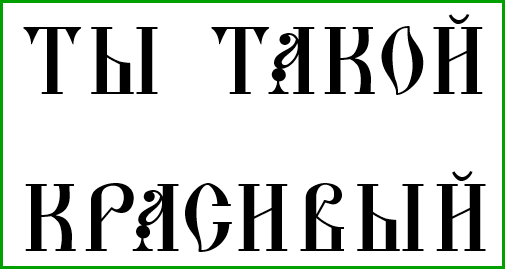 | 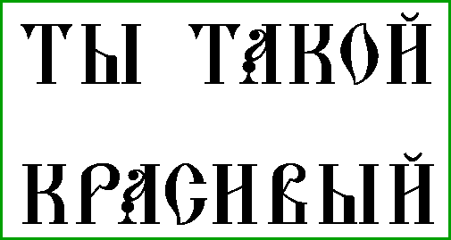 |

---

# Профили изображения

Для изображения рассчитываются два профиля:

- горизонтальный профиль — сумма чёрных пикселей по строкам;
- вертикальный профиль — сумма чёрных пикселей по столбцам.

Профили сохраняются в виде PNG-файлов в папку:

```text
lab6_output/profiles/
```

Для всего изображения сохраняются файлы:

```text
horizontal_profile_full.png
vertical_profile_full.png
```

Для найденной текстовой области сохраняются файлы:

```text
horizontal_profile_text.png
vertical_profile_text.png
```

Для каждой найденной строки сохраняются файлы:

```text
line_01_horizontal_profile.png
line_01_vertical_profile.png
line_02_horizontal_profile.png
line_02_vertical_profile.png
...
```

---

# Примеры профилей изображения

| Горизонтальный профиль | Вертикальный профиль |
|---|---|
| 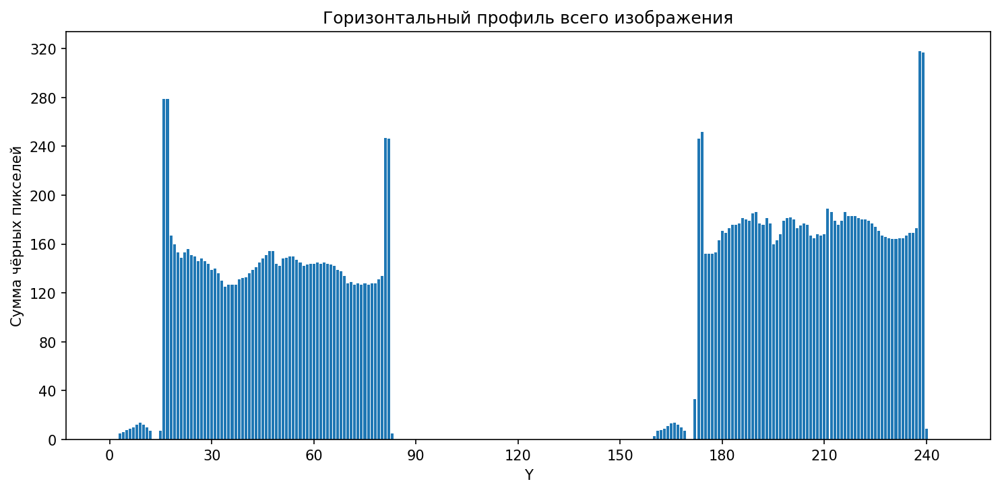 | 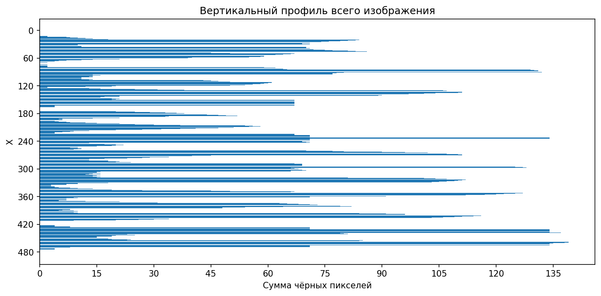 |

| Горизонтальный профиль текста | Вертикальный профиль текста |
|---|---|
| 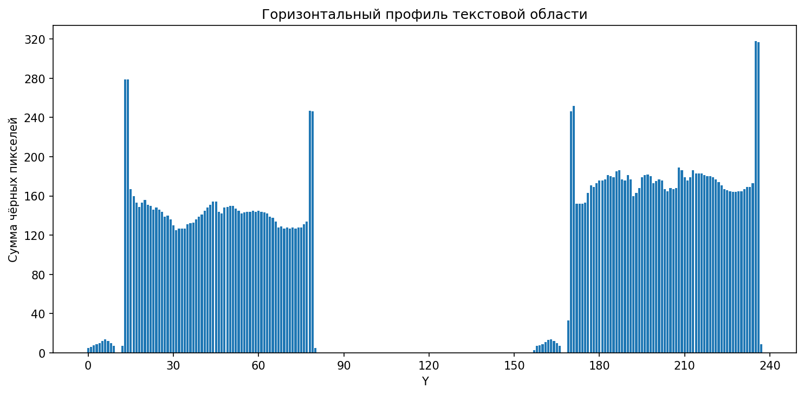 | 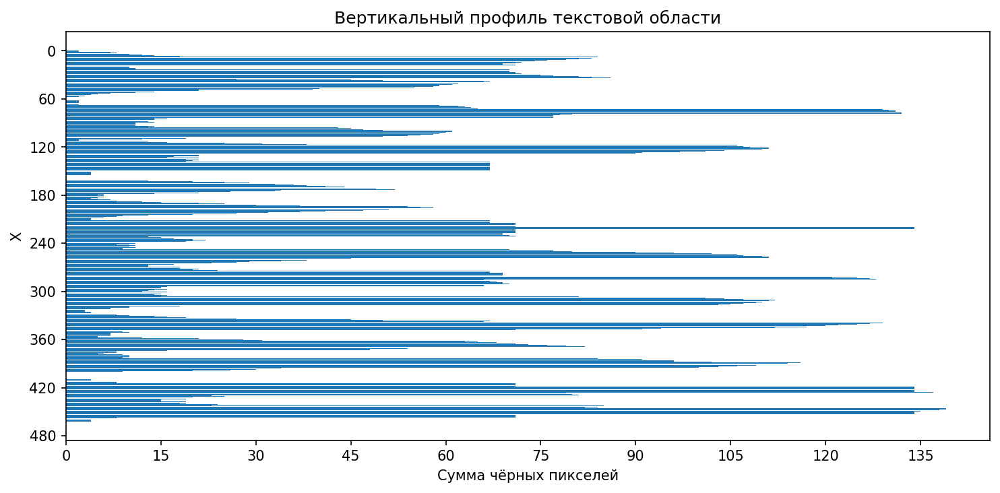 |

---

# Сегментация текста

Сегментация выполняется в несколько этапов.

## Обрамляющий прямоугольник текста

Сначала определяется общий прямоугольник, который содержит все чёрные пиксели изображения.

Координаты прямоугольника имеют формат:

```text
x1, y1, x2, y2
```

где:

- `x1`, `y1` — левый верхний угол;
- `x2`, `y2` — правый нижний угол.

## Сегментация строк

Для выделения строк используется горизонтальный профиль текстовой области.

Алгоритм выполняет:

1. построение горизонтального профиля;
2. пороговую обработку профиля;
3. склейку коротких разрывов;
4. удаление коротких шумовых участков;
5. построение прямоугольников строк.

## Сегментация символов

Для выделения символов используется вертикальный профиль каждой строки.

Особенность реализации заключается в том, что вертикальный профиль строится не по всей высоте строки, а по её центральной части. Это помогает уменьшить влияние верхних декоративных элементов символов.

Алгоритм выполняет:

1. выделение центральной части строки;
2. построение вертикального профиля;
3. пороговую обработку профиля;
4. выделение предварительных диапазонов символов;
5. разделение слишком широких сегментов по локальным минимумам профиля;
6. уточнение координат по реальным чёрным пикселям;
7. склейку близких мелких фрагментов.

В результате получается массив прямоугольников символов, упорядоченный в порядке чтения:

```text
слева направо, сверху вниз
```

---

# Визуализация сегментации

Результаты сегментации сохраняются в папку:

```text
lab6_output/visualizations/
```

Сохраняемые файлы:

```text
text_box.png
lines_boxes.png
chars_boxes.png
all_boxes.png
```

### text_box.png

Изображение с общим обрамляющим прямоугольником текста.

### lines_boxes.png

Изображение с прямоугольниками найденных строк.

### chars_boxes.png

Изображение с прямоугольниками найденных символов.

### all_boxes.png

Общая визуализация, на которой показаны:

- синий прямоугольник — весь текст;
- зелёные прямоугольники — строки;
- красные прямоугольники — символы.

---

# Примеры визуализации сегментации

| Текст | Строки | Символы |
|---|---|---|
| 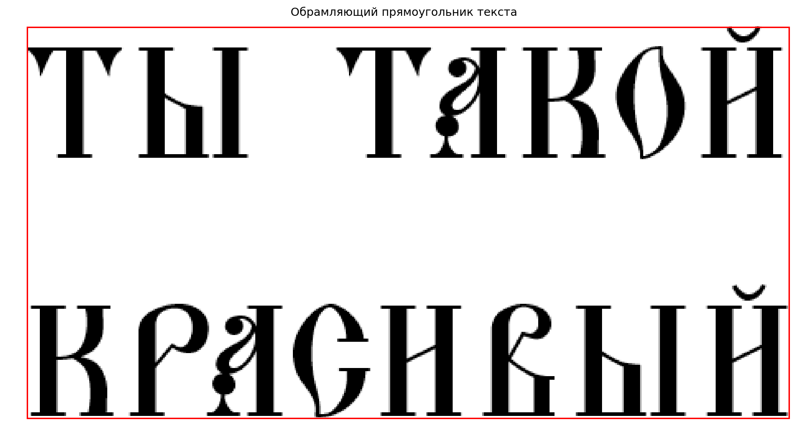 | 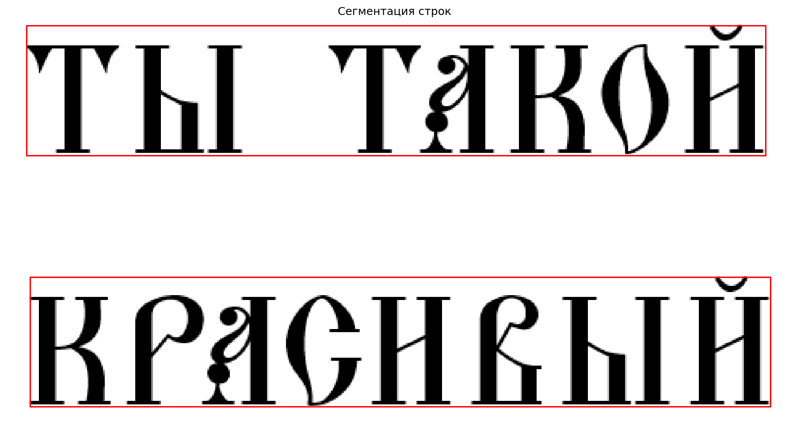 | 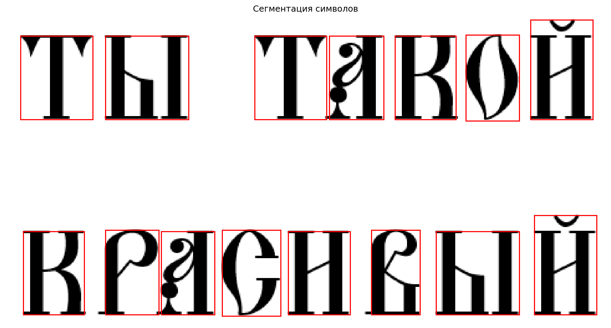 |

| Общая визуализация |
|---|
| 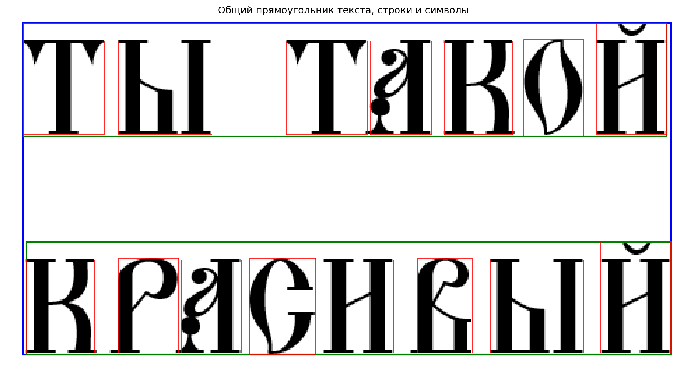 |

---

# Вырезанные символы

Каждый найденный символ вырезается из бинарного изображения и сохраняется в отдельный файл в папку:

```text
lab6_output/segmented_chars/
```

Файлы сохраняются в формате:

```text
char_001.png
char_002.png
char_003.png
...
```

---

# Примеры вырезанных символов

| Символ 1 | Символ 2 | Символ 3 |
|---|---|---|
| 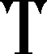 |  | 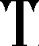 |

| Символ 4 | Символ 5 | Символ 6 |
|---|---|---|
| 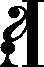 | 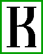 | 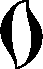 |

---

# Координаты прямоугольников

Все найденные прямоугольники сохраняются в CSV-файл:

```text
lab6_output/rectangles.csv
```

Файл содержит следующие столбцы:

```text
type;index;x1;y1;x2;y2
```

Где:

- `type` — тип объекта;
- `index` — порядковый номер;
- `x1`, `y1`, `x2`, `y2` — координаты прямоугольника.

Возможные значения `type`:

- `text` — общий прямоугольник текста;
- `line` — прямоугольник строки;
- `char` — прямоугольник символа.

---

# Профили символов алфавита

Дополнительно программа строит профили для каждого символа выбранного алфавита.

Для каждого символа выполняются следующие действия:

1. рендеринг символа шрифтом Ponomar Unicode;
2. бинаризация изображения;
3. обрезка белых полей;
4. вычисление профиля `X`;
5. вычисление профиля `Y`;
6. сохранение изображения символа;
7. сохранение графика профилей.

Изображения символов сохраняются в папку:

```text
lab6_output/alphabet_symbols/
```

Профили символов сохраняются в папку:

```text
lab6_output/alphabet_profiles/
```

Файлы сохраняются с безопасным именем в формате:

```text
U+КОД_СИМВОЛ.png
U+КОД_СИМВОЛ_profiles.png
```

---

# Примеры символов алфавита

| Символ А | Символ Б | Символ Ѣ |
|---|---|---|
|  | 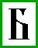 | 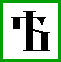 |

| Символ Ѡ | Символ Ѯ | Символ Ѩ |
|---|---|---|
|  | 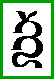 | 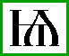 |

---

# Примеры профилей символов алфавита

| Символ А | Символ Б | Символ Ѣ |
|---|---|---|
| 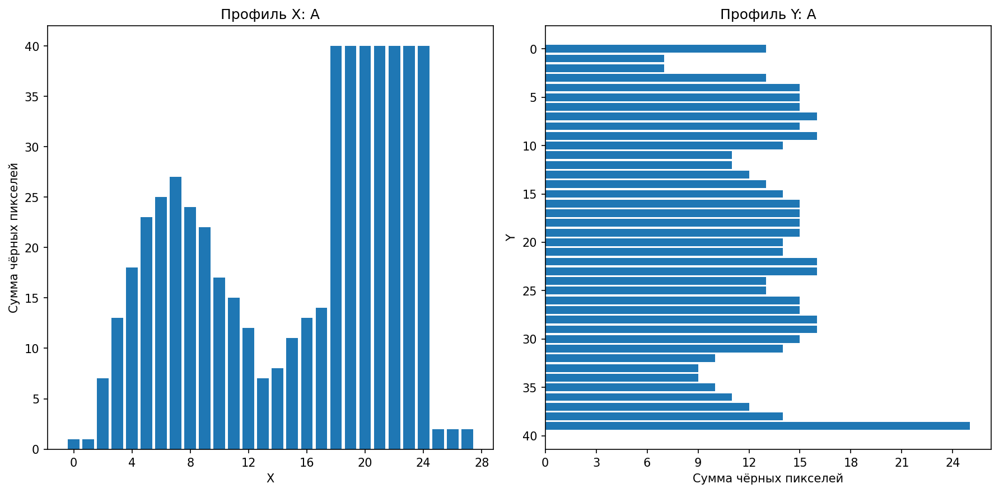 | 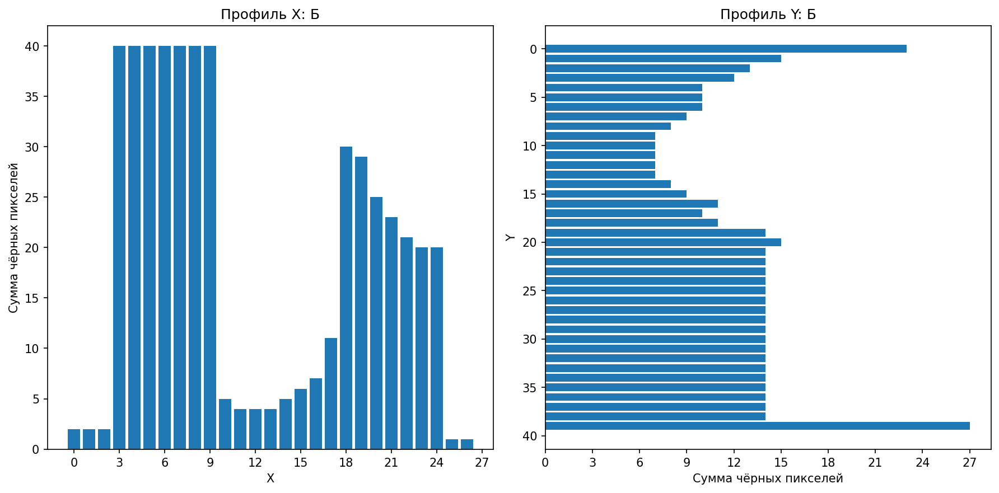 | 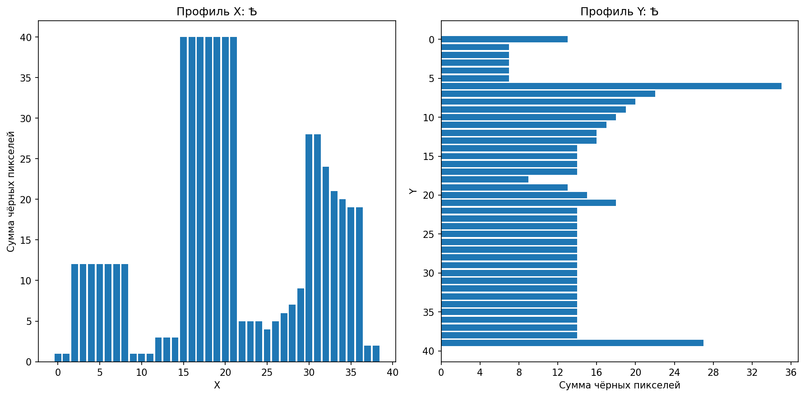 |

| Символ Ѡ | Символ Ѯ | Символ Ѩ |
|---|---|---|
| 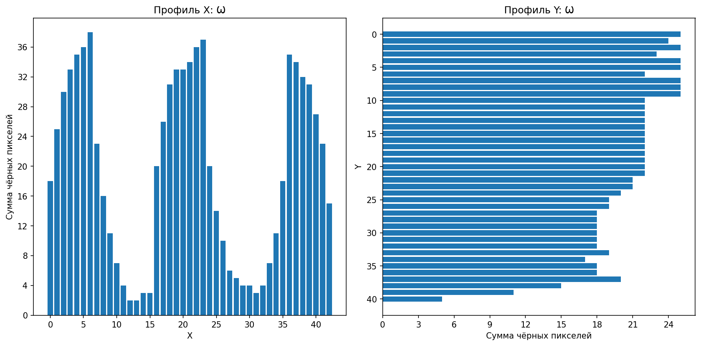 | 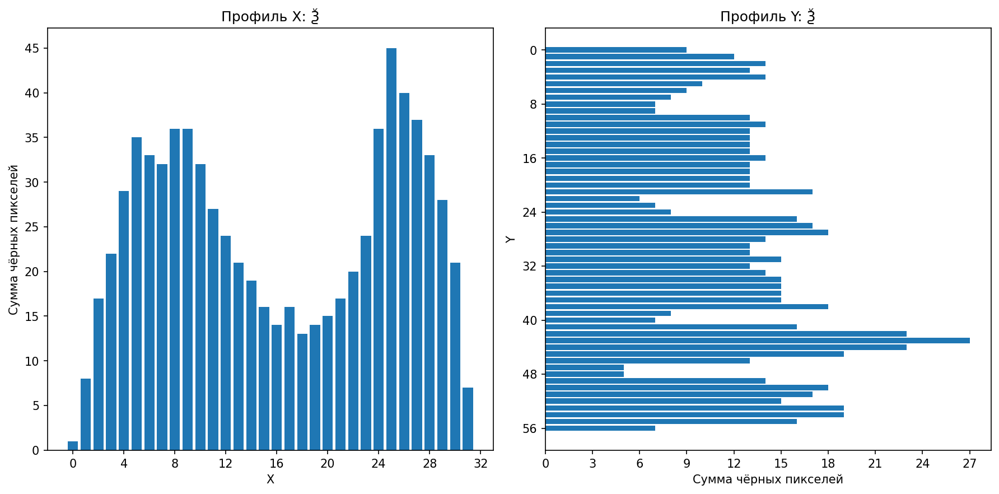 | 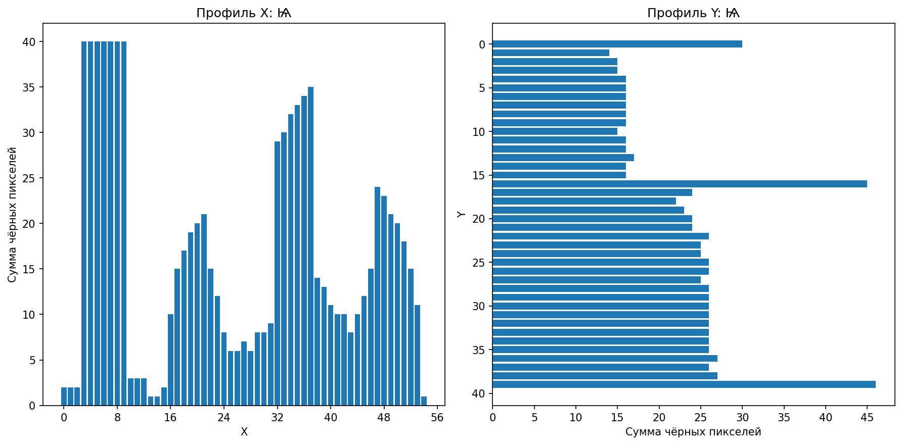 |

---

# Установка

Установка зависимостей:

```bash
pip install pillow numpy matplotlib
```

---

# Запуск программы

Запуск программы:

```bash
python laba6.py
```

Перед запуском необходимо:

1. положить входной BMP-файл в папку со скриптом;
2. установить шрифт Ponomar Unicode;
3. указать путь к шрифту в переменной `FONT_PATH`, если автоматический поиск не используется.

---

# Примечание

Для программы нужно указать путь к шрифту вручную в переменной:

```text
FONT_PATH
```

Пример:

```text
FONT_PATH = r"C:\Users\m9164\AppData\Local\Microsoft\Windows\Fonts\PonomarUnicode.ttf"
```

Если путь к шрифту не указан или файл не найден, программа завершится с ошибкой.
